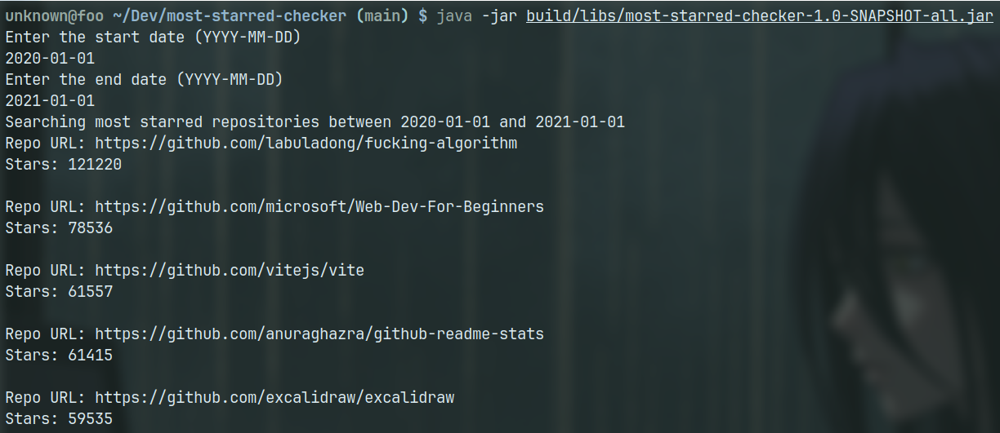

# Most Starred Checker

Another Java application I did for learning purposes. Got the idea from the "CLI
Apps" checkpoint on the [fullstack roadmap](https://roadmap.sh/full-stack)

## How to use

`gradle clean build` &&
`java -jar build/libs/most-starred-checker-1.0-SNAPSHOT-all.jar`

## Preview

